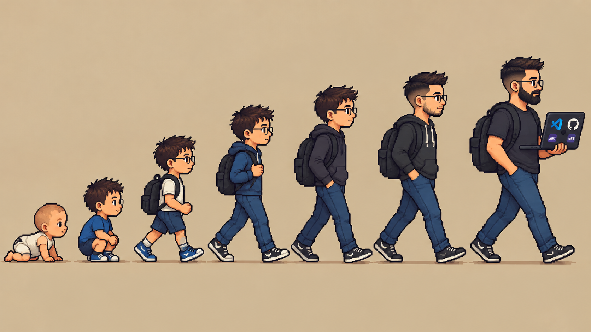

<h1 data-importer="text" align="left">Hey 👋 What's up? I'm Lucas ​!</h1>

###

<h4 data-importer="text" align="left">My name is Lucas Petito and I'm a Full Stack .NET Developer, from Cabo Frio, RJ, Brazil ​​🇧🇷</h4>

###

<h2 data-importer="text" align="left">This is me 👌​</h2>

###

<h6 data-importer="text" align="left">Full Stack .NET Developer focused on scalable system architecture, REST APIs, and database optimization, applying SOLID and Clean Architecture principles. I integrate AI into my development lifecycle — assisted refactoring, static analysis, and test generation — and use Spec-Driven Development to improve architectural consistency and reduce rework.</h6>

###

✨ Creating bugs since 2019 📚 I'm currently learning Cloud architecture on Azure and advanced AI-assisted software engineering practices 🎯 Goals: Keep learning and growing in my field as a high-quality professional, and — who knows — work abroad one day 🎲 Fun fact: I've always loved animation and game design, but I always struggled with physics and math exercises — working with equations. Seeing everything I loved alongside what I found hard, I got into programming to improve what I already loved and help me with what I struggled with.

###

<h2 data-importer="text" align="left">I work with 🌐​:</h2>

###

  
  
  
  
  
  
  
  
  
  
  
  
  
  
  
  
  
  
  
  
  
  
  
  
  
  
  
  
  
  
  
  
  
  
  
  
  
  
  
  
  
  
  
  
  
  
  

###

  

###
